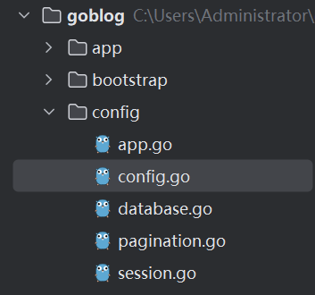
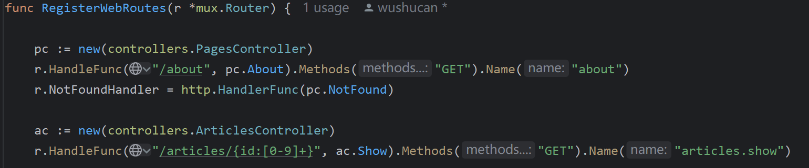

# goblog

从服务的流程来记录。

## main.go

```go
func init() {
	config.Initialize()
}

func main() {
	bootstrap.SetupDB()
	router := bootstrap.SetupRoute()
	http.ListenAndServe(":"+c.GetString("app.port"), middlewares.RemoveTrailingSlash(router))
}
```

init表示配置的初始化，用于配置类似端口号`c.GetString("app.port")`等操作。

### config

先看看怎么配置文件的：



package config和package app同级，用于全局配置。

其中app, database, pagination, session等go文件用于不同模块的配置。

如端口号的配置：

```go
//第二个参数为defaultValue，应该可以去掉，直接从文件中读取
func init() {
	config.Add("app", config.StrMap{
		"name": config.Env("APP_NAME", "GoBlog"),

		// 当前环境，用以区分多环境
		"env": config.Env("APP_ENV", "production"),

		// 是否进入调试模式
		"debug": config.Env("APP_DEBUG", false),

		// 应用服务端口
		"port": config.Env("APP_PORT", "3000"),

		// gorilla/sessions 在 Cookie 中加密数据时使用
		"key": config.Env("APP_KEY", "33446a9dcf9ea060a0a6532b166da32f304af0de"),

		"url": config.Env("APP_URL", "http://localhost:3000"),
	})
}
```

其中config.Add来自pkg/config/config.go包，调用了`"github.com/spf13/viper"`框架。

viper则设置.env文件为文件配置

.env

```
APP_NAME=myapp
APP_ENV=local
APP_KEY=33446a9dcf9ea060a0a6532b166da32f304af0de
APP_DEBUG=true
APP_URL=http://localhost:3000
APP_LOG_LEVEL=debug
APP_PORT=3000

DB_CONNECTION=mysql
DB_HOST=127.0.0.1
DB_PORT=3306
DB_DATABASE=goblog
DB_USERNAME=root
DB_PASSWORD=

SESSION_DRIVER=cookie
SESSION_NAME=goblog-session
```

### bootstrap

bootstrap在此设置了数据库，并设置了路由。bootstrap在此的意思是：程序模块初始化目录。

```go
	bootstrap.SetupDB()
	router := bootstrap.SetupRoute()
```

SetupDB()：

AutoMigrate是GORM框架中根据struct在数据库中创建数据模型的函数。

```go
func SetupDB() {
	db := model.ConnectDB()

	sqlDB, _ := db.DB()

	sqlDB.SetMaxOpenConns(config.GetInt("database.mysql.max_open_connections"))
	// 设置最大空闲连接数
	sqlDB.SetMaxIdleConns(config.GetInt("database.mysql.max_idle_connections"))
	// 设置每个链接的过期时间
	sqlDB.SetConnMaxLifetime(time.Duration(config.GetInt("database.mysql.max_life_seconds")) * time.Second)

	migration(db)
}

func migration(db *gorm.DB) {
	db.AutoMigrate(
		&user.User{},
		&article.Article{},
	)
}
```

SetupRoute()：

```
func SetupRoute() *mux.Router {
	router := mux.NewRouter()
	routes.RegisterWebRoutes(router)

	route.SetRoute(router)

	return router
}
```

这里有三个"route"，有点绕。

第一个route：是`"github.com/gorilla/mux"`框架内置的route，该函数的返回值也是这个，作为`http.ListenAndServe`函数的参数。

第二个route：来自`"goblog/routes"`，该包下有一个web.go，用于配置不同的路由：



第三个route：来自`"goblog/pkg/route"`，调用时，将全局路由传入，用于支持前端页面：

```go
func SetRoute(r *mux.Router) {
	route = r
}
//构建特定路由的 URL
func RouteName2URL(routeName string, pairs ...string) string {
	url, err := route.Get(routeName).URL(pairs...)
	if err != nil {
		logger.LogError(err)
		return ""
	}

	return config.GetString("app.url") + url.String()
}
//从请求中获取特定路由参数的值
func GetRouteVariable(parameterName string, r *http.Request) string {
	vars := mux.Vars(r)
	return vars[parameterName]
}
```

### http.ListenAndServe

这边主要是关注中间件的实现和调用。

## 程序框架

主函数了解之后，基本可以看看各个模块是干啥的了：

```go
├── app                            // 程序具体逻辑代码
│   ├── http                        // http 请求处理逻辑
│   │   ├── controllers             // 控制器，存放 API 和视图控制器
│   │   └── middlewares             // 中间件
│   ├── models                      // 数据模型
│   ├── policies                    // 授权策略目录
│   │   ├── topic_policy.go
│   │   └── ...
│   └── requests                    // 请求验证目录（支持表单、标头、Raw JSON、URL Query）
├── bootstrap                       // 程序模块初始化目录
│   ├── db.go  
│   └── route.go
├── config                          // 配置信息目录
├── pkg                             // 内置辅助包
│   ├── app
│   ├── auth
│   ├── cache
│   ├── captcha
│   ├── config
│   └── ...
├── public                          // 静态文件存放目录
│   ├── css
│   ├── js
│   └── ...
├── routes                          // 路由
│   ├── api.go
│   └── web.go
├── resources                       // 前端页面
└── tmp                             // air 的工作目录
├── .env                            // 环境变量文件
├── .env.example                    // 环境变量示例文件
├── .gitignore                      // git 配置文件
├── .editorconfig                   // editorconfig 配置文件
├── go.mod                          // Go Module 依赖配置文件
├── go.sum                          // Go Module 模块版本锁定文件
├── main.go                         // Gohub 程序主入口
└── readme.md                       // 项目 readme
```

## ac.Store

从存储文章看整体逻辑：

```go
r.HandleFunc("/articles", middlewares.Auth(ac.Store)).Methods("POST").Name("articles.store")
```

首先说说`ac.Store`这个函数。

ac变量来自控制器ArticlesController，Store函数体：

```go
func (*ArticlesController) Store(w http.ResponseWriter, r *http.Request) {
	currentUser := auth.User()
	fmt.Print(currentUser)
	_article := article.Article{
		Title:  r.PostFormValue("title"),
		Body:   r.PostFormValue("body"),
		UserID: currentUser.ID,
	}

	// 验证标题
	errors := requests.ValidateArticleForm(_article)

	// 检查是否有错误
	if len(errors) == 0 {
		_article.Create()
		if _article.ID > 0 {
			fmt.Fprint(w, "插入成功，ID 为"+strconv.FormatUint(_article.ID, 10))
		} else {
			w.WriteHeader(http.StatusInternalServerError)
			fmt.Fprint(w, "创建文章失败，请联系管理员")
		}
	} else {
		view.Render(w, view.D{
			"Article": _article,
			"Errors":  errors,
		}, "articles.create", "articles._form_field")
	}
}
```

这其中涵盖了：

1.授权，即`auth`

2.模型的创建，即`_article`

3.验证，即`ValidateArticleForm`

4.界面组装，即`Render`

接下来看他们是怎么做的。

### 授权

授权属于中间件的部分，授权来自`"goblog/pkg/auth"`，而auth又依赖`"goblog/pkg/session"`，与此同时session依赖`"github.com/gorilla/sessions"`。可以看到是对gorilla/sessions框架的使用。

看看源码：

```go
type Session struct {
	// The ID of the session, generated by stores. It should not be used for
	// user data.
	ID string
	// Values contains the user-data for the session.
	Values  map[interface{}]interface{}
	Options *Options
	IsNew   bool
	store   Store
	name    string
}
```

主要依赖字段`Values  map[interface{}]interface{}`，如Get函数获取会话数据：

```go
func Get(key string) interface{} {
	return Session.Values[key]
}
```

通过session保证单一用户的操作。

### 模型的创建

属于models部分，dao层的内容。

### 验证

使用`"github.com/thedevsaddam/govalidator"`框架处理请求，这部分主要是进行验证。

### 界面组装

```go
func Render(w io.Writer, data D, tplFiles ...string) {

}

func RenderSimple(w io.Writer, data D, tplFiles ...string) {

}

func RenderTemplate(w io.Writer, name string, data D, tplFiles ...string) {

}
```

通过tplFiles传入多个html页面，最后组装起来，该函数需要配合html的编写和分割来使用。

## 中间件